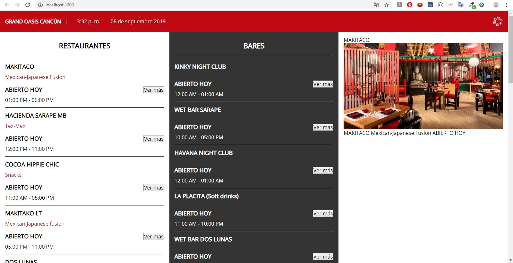

# Oasis

## Technical data

```shell
Angular CLI: 8.3.3
Node: 10.16.0
OS: win32 x64
npm: 6.11.3
```

## Install

```bash
  # Prefer install
  npm install -g @angular/cli

  # Clone repository
  git clone https://github.com/devlegacy/front-oasis-primera-fase.git

  # change directory to front-oasis-primera-fase
  cd ./front-oasis-primera-fase

  # Install dependencies
  npm i
```

## Run project

```bash
  # Run
  ng serve -o
  # Prefer url: http://localhost:4000
```

## Example



## Notes

Variables de entorno.

API_URL: 'http://localhost:8000/api/'
ASSETS_API_URL: 'https://api-onow.oasishoteles.net/'

En caso de cambiar alguna, modificar el archivo:

+&nbsp;:open_file_folder: `project-name`

&nbsp;|&nbsp;&nbsp;+-- :open_file_folder: `src`

&nbsp;|&nbsp;&nbsp;&nbsp;|&nbsp;&nbsp;+-- :open_file_folder: `enviroments`

&nbsp;|&nbsp;&nbsp;&nbsp;|&nbsp;&nbsp;&nbsp;|&nbsp;&nbsp;--- :page_facing_up: `environment.ts`

## TODO

- Crear componentes independientes para restaurantes, bares y el centro de consumo seleccionado.
- Solicitar y usar url /api/hotels/1 para usar un servicio y traer información del hotel exclusivamente en el componente de cabecera.
- Cambiar dinamicamente url para que apunte hotel y al centro de consumo con un slug (/gran-oasis/hacienda-sarape)
- Mejorar archivos y funciones SCSS.